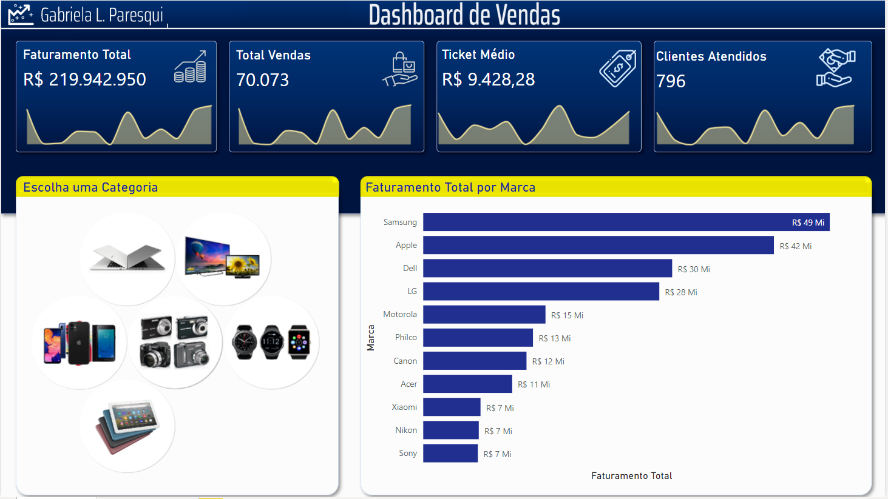
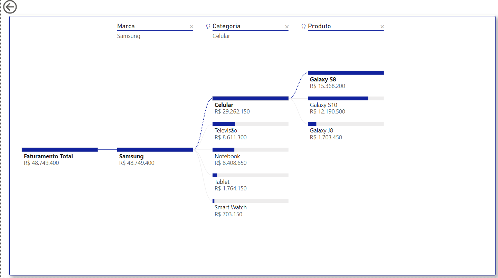

# Dashboard de Vendas

## Contexto
Neste projeto, desenvolvi um relatório de vendas utilizando a ferramenta Microsoft Power BI. A ideia principal deste projeto foi apresentar informações de vendas extraídas a partir do arquivo Base Vendas.xlsx. O projeto foi desenvolvido durante a semana do Intensivão de PowerBI da Hashtag Treinamentos. Os dados são de uma loja de produtos eletrônicos e eletrodomésticos e a análise foi feita com dados de vendas que compreendem um período que vai de 2018 a 2020. A imagem abaixo mostra os resultados da análise.

### * Gráfico de Árvore Hierárquica

